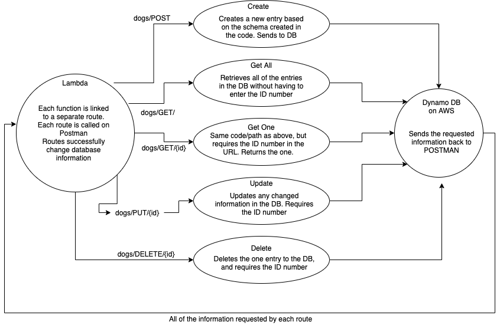

# serverless-api

## UML

## root URL

> Root URL: https://sz8evusnlf.execute-api.us-west-2.amazonaws.com/dogs/

## Routes

> GET: URL/
> GET ONE: URL/{id}
> POST: URL/
> PUT: URL/{id}
> DELETE: URL/{id}

## required inputs

>"breed": String,
>"color": an array of strings,
>"age": number,
>"sheds": boolean (default is true)

## returning output

> An object that includes the id number:
> i.e. {"sheds":false,"id":"e0e52c84-bb59-4c8c-9878-a27ae1ab2078","breed":"Corgi","color":["tan"],"age":2}

## acknowledegment

> Thank you to Sara Strasner for suggesting how to handle testing
